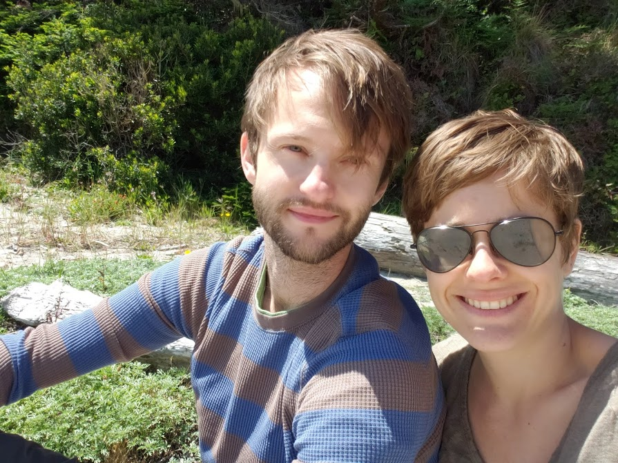

<h2>What motivated us to start the co-op trail?</h2>

The year 2020 has opened a lot of people's eyes to the cruelty of the economic system that operates in the United States today. It certainly has caused us to rethink our place in an economy of extraction and exploitation. We feel that we're part of larger awakening taking place about the solidarity economy and the co-op movement today. The Co-op Trail is our attempt to join in this movement by making it more tangible to others who are new to these ideas and want to get to know the sense of scale of this economy. 

The core problem we want to solve with the Co-op Trail is that the solidarity economy can feel harder to find and harder to approach than traditional businesses. So we founded the Co-op Trail to blaze a path that physically connect co-ops to each other <em>and</em> to a wider community that wants to interact on a global scale. We hope that someday this kind of effort will help co-ops see how to fill in the gaps (both physical and logistic) so that more people can transition to operating in the solidarity economy alone. 

<h2 id="content">Why do we believe in the solidarity economy?</h2>

There are a lot of myths in the collective psyche of the United States: pull yourself up by your bootstraps, competition causes prosperity, manifest destiny. Over time, these myths of independence have eroded our personal sense of decency and our collective faith in society. The solidarity economy offers a compelling counter-narrative: that it's been America's history of radical cooperation that sets us apart. We believe the solidarity eceonomy is crucial in bringing our society back into balance.

This is the story we believe in. That the goodness of people has been what's propped up this country, not <em>because</em> of our notions of exceptionalism, but <em>in spite of them</em>.  And the solidarity economy is an attempt to re-reveal the true values of cooperation, moving them out from the background and back to their central place in a functioning society. 

<h2 id="content">How did we design the trail?</h2>

We relied heavily on the <a href="https://solidarityeconomy.us/
">Solidarity Economy Map</a>, <a href="https://identity.coop/directory">identity.coop directory</a> and the <a href="https://www.usworker.coop/directory/">US Federation of Worker Cooperatives directory</a> to find locations to connect. For larger towns and cities that we were visiting, we would also search for "cooperatives" along with the city name to find other cooperatives not included on those sites. Check out our <a href="/resources.html">Resources Page</a> to get more information about all the sources we used. The goal is to continue to flesh out the trail over multiple trips during the next few years.  If you have a suggestion for any additional resources you think would be helpful, please send them our way with the form at the bottom of this page.

<h2>Who are the Trail Curators?</h2>

The founding Trail Curators are Claire and Will Stedden. <a href="https://www.linkedin.com/in/clairestedden">Claire</a> is a medical writer who loves hiking and camping.  <a href="https://will.stedden.org/">Will</a> is a data scientist who likes biking and making maps. Together we came up with the idea to travel and visit co-ops around the country with the hope of raising awareness about the solidarity economy. We live in Mendocino County California and love to travel throughout the western and midwest United States. 

If you want to become a Trail Curator, reach out in the form below. We support our Trail Curators to visit and report on co-ops all around the country.

