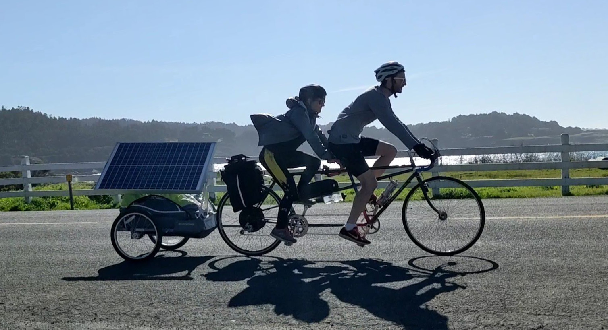

<h2>What motivated us to start the co-op trail?</h2>

The year 2020 has opened a lot of people's eyes to the cruelty of the economic system that operates in the United States today. It certainly has caused us to rethink our place in an economy of extraction and domination. And as we felt our own awareness of the solidarity economy and the co-op movement growing, we recognized that we were part of a larger awakening taking place. The Co-op Trail was our attempt to join in this movement by hopefully making it more accessible and tangible to others who are new to these ideas and want to get to know the sense of scale of this economy. 

The core problem we wanted to solve with the Co-op Trail was that co-ops feel hard to approach from outside and less "discoverable" than traditional businesses. While this is a great feature for serving community, it poses a major hurdle to regular people like us who are used to engaging in traditional, "takes-all-comers" commerce. So we founded the Co-op Trail to blaze a path that physically connect co-ops to each other <em>and</em> to a wider community that wants to interact on a global scale. We hope that someday this kind of effort will help co-ops see how to fill in the gaps (both physical and logistic) so that more people can transition to operating in the solidarity economy on its own. 

<h2 id="content">Why do we believe in the solidarity economy?</h2>

There are a lot of myths in the psyche of the United States: pull yourself up by your bootstraps, competition causes prosperity, manifest destiny. The solidarity economy offers a compelling counter-narrative: that it's been America's history of radical co-operation that sets us apart. We feel that these myths of independence have eroded our personal sense of decency and our collective faith in society. And we think our country won't recover our shared dignity until we regain an equal footing between the legal system that defines ownership, the actual workers who truly build everything of value, and the citizens who utilize that value. We believe the solidarity eceonomy is crucial in bringing those segments of society back into balance.

This is the story we believe in. That the goodness of people has been what's propped up this country, not <em>because</em> of our notions of exceptionalism, but <em>in spite of them</em>.  And the solidarity economy is an attempt to re-reveal the true values of our country, moving them out from the background and back to their central place in a functioning society. 

<h2>Who are the Trail Curators?</h2>

The founding Trail Curators are Claire and Will Stedden. <a href="https://www.linkedin.com/in/clairestedden">Claire</a> is a medical writer who loves hiking and camping.  <a href="https://will.stedden.org/">Will</a> is a data scientist who likes biking and making maps. Together we came up with the idea to travel and visit co-ops around the country with the hope of raising awareness about the solidarity economy. We live in Mendocino County California and love to travel throughout the western and midwest United States. 

If you want to become a Trail Curator, reach out in the form below. We support our Trail Curators to visit and report on co-ops all around the country.

